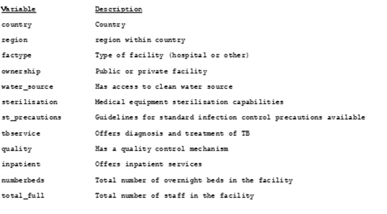
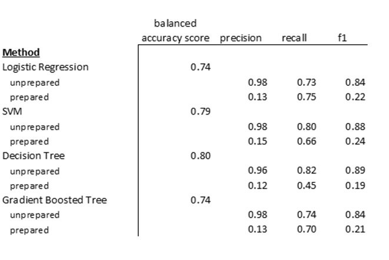

# COVID-19_Readiness_and_Response

Project Plan:  COVID Readiness & Response
UC Berkeley Data Analysis Boot Camp
Group Project – Team 4

# Presentation for this project 
https://docs.google.com/presentation/d/1lAy8StLDQWyf62V-8jowSlDHaiTOXzar5aKAlyttHUI/edit?usp=sharing

# Overview:

As the global pandemic of COVID19 continues to rage around the world, health systems in developing countries need mechanisms to prioritize resources for infection prevention and control.  Health facilities need guidance and materials, such as disinfectant and personal protective equipment (PPE), to help prevent infections within their facilities where potentially infected individuals congregate seeking treatment for COVID and other diseases.  But public health resources are insufficient to blanket the system with resources, and this would in any case be inefficient since some facilities already have sufficient capacity to prevent infection.  

Team 4 proposes the development of a predictive model using machine learning to identify health facilities (or the districts in which they are located) in selected developing countries most in need of capacity building for infection prevention and control.  If such a model could accurately predict which facilities and/or districts are most in need, the savings in time and resources would be substantial, and resources would be freed up for other program areas and diseases.

# Data sources:
For over 30 years, the United States Agency for International Development (USAID) has supported the Demographic and Health Surveys Program (DHS Program). The DHS Program provides technical assistance and funding for the implementation of more than 320 household and facility-based surveys in 90 countries across Africa, Asia, Latin America/Caribbean and Eastern Europe.  Two of these surveys, the Service Provision Assessment (SPA), a health facility assessment to measure service availability and readiness, and the Demographic and Health Survey (DHS), a population-based survey to measure social, demographic, and health status characteristics of populations, would serve the needs of our predictive model. 

In the SPA, health facility service readiness includes elements of infection control and prevention.  For instance, the survey measures whether a health facility has 
- a continuous source of clean water, 
- effective mechanisms for medical waste disposal, 
- PPE (e.g. masks, gowns, eye protection, sterile gloves, etc.),
- disinfectant,
- guidelines for infection control
- others.

An index of readiness to prevent and control infection can be calculated from the above indicators and a threshold value for readiness established whereby facilities can be grouped as ready, or not, to provide services safely during the pandemic.   Other variables of interest to help predict readiness are also available in the SPA, such as facility type (e.g. hospital, health center, health post), number of beds (a measure of capacity, or size), number of health care workers present, etc.

We can also link the DHS to this data set which would provide population-based estimates of demographic information, such as socio-economic status, level of education, age distribution, prevalent occupations, and other characteristics of the population served by the health facility.  These estimates, based on a house-hold survey, would be applicable at the domain of estimation of the survey, for example the geographic region of the country in which the facility resides.  All facilities in the same region would therefore have the same value.

We will start with data from one country, and if the results are promising we can extend to multiple countries, potentially.  Ideally the country would have conducted a SPA and DHS surveys in the same year.  Since SPA surveys are conducted far less often than DHS, we will focus on countries having implemented the SPA, and ideally recently.  Potential candidate countries include the Democratic Republic of the Congo (DRC), and Senegal, which have both conductedthe SPA and DHS in recent years.

# Data Management
The data are available in many formats (CSV, JSON, geoJSON, XML, to name a few), and also via Application Program Interface (API).  We will acquire the data and load it into a PostgreSQL database at Amazon RDS.

Data were downloaded from the DHS Project website in .CSV format.  The data from the facility assessment was recoded in Statistical Package for the Social Sciences (SPSS) Version 18 for Windows.  From the 1700 variables in the datafile a subset of 30 relevant to the analysis was extracted, coded, merged with the GPS data and across countries before being  downloaded to .CSV.  It was then imported into PostreSQL.  Demographic data, also from the DHS Project, was downloaded for the four focal countries from the Statcompiler (https://www.statcompiler.com/en/).

[Sample data](https://github.com/hannahrim/COVID-19_Readiness_and_Response/blob/Jueun-Lee/sampleData.csv)

# Dashboard
We will use Tableau to create graphics (bar charts) to show differences between geographic areas for different predictors.  We will use Flask to show a map of readiness for infection control within the country.

# Model (Data Analysis)
We used a supervised machine learning classification model to classify health facilities and districts as either ready to provide health services safely (i. used adequate readiness for infection control and prevention), or not ready.  We used python with the sklearn, numpy, pandas, scipy modules to explore the accuracy, precision and recall of predictions from several approaches;  Logistic regression, Support Vector Models (SVM), Decision Trees, and Gradient Boosted Tree.  

Data were called from the PostgreSQL database at Amazon RDS using SQLAlchemy and Flask.  We made a dataframe to select out variables for the analysis and removed missing values using DropNa().  We created an outcome variable (prep2) to model preparedness for disease control and prevention by combining the predicators as follows:  if facilities were found to have medical masks, latex gloves, disinfectant, and soap and water available at the site on the day of the assessment they were considered prepared.  If any of these items was not present they were considered unprepared.  About 5% of facilities were judged prepared by this criteria.

Predicators selected for model included:

Other predicators were also explored.  Numbers of cases and deaths of COVID19 for each country were obtained from the World Health Organization (WHO) website:  (www.who.int).  Theses data were only available at regional level for each country.  

We created classes from the data; we dropped the outcome variable 'prep2' from the dataframe (y) and the remaining variables were labeled X.  We trained the model using from  train_test_split from sklearn.model_selection using the default 75%/25% split.  We ran a logistric regression model using scipy.  

We ran into problems of convergence and needed to scale the data using the "tandardScaler from sklearn.preprocessing.  After scaling the the outcome variable we had to convert the data type from float to integer in order to run the model successfully.  We had a very small minority class (i.e. facility is prepared) and needed to oversample to boost the ability to make predictions.  We tried random and SMOTE for oversampling, and SMOTEENN for combination sampling, though there was no appreciable difference in performance among the different methods. We varied predictors to find the optimum set which provided the highest predictive value.  We calculated a balanced accuracy score using balanced_accuracy_score from sklearn.metrics.  We calculated an imbalanced classification matrix to show accuracy, precision, recall, and F1 scores for the minority and majority classes using classification_report_imbalanced from imblearn.metrics.
 
  
## Final Results

While the accuracy of the models is fairly good (0.74-0.80), the precision is poor for the minority class (0.12-0.15).  A similar pattern was true for recall and F1 scores whereby the value is good for the majority class (unprepared), and poor for the minority class (prepared).

The best performing (and final) model included the following predicators: country, ownership, ftype, quality, inpatient, st_precautions, tbservice, and water_source.

# Challenges
-These models are not very good at predicting preparedness for infection control
-Non-standard data across countries, particularly with regard to region and demographic data.  For example, in DRC the facility assessment data is distributed among 26 regions of the country whereas the demographic data is subdivided into 10 regions.  These data were not possible to merge adequately.  In Senegal, the demographic data was sub-divided into four regions, whereas the facility data was grouped into 10 regions.  
-Lack of granularity in the cases and deaths data (and incongruence with regard to time). The COVID cases and deaths data is from 2020 whereas the facility data is from 2-3 years ago depending on the country.  It is not reasonable to believe that cases this would have had an effect on health facility preparedness from 2016-2018.  
-Convergence. The models were unable to converge prior to scaling the data.  Oversampling also helped balance the model and improved performance.

# Next Steps
-Explore methods to better integrate the demographic data
-More information on COVID cases and deaths will become available over time
-Explore methods to better utilize the GPS data. For example, the distance of facilities to big cities could be calculated for all facilities for which latitude and longitude data are available.  Distance to population centers is likely predictive of preparedness for infection control. 
-Explore other ways of defining preparedness.  The facilities labeled as prepared were a small subset of the data (only ~ 5%).  Relaxing the standard for preparedness may make the model more robust at prediction by increasing the number of facilities deemed prepared.  Alternatively, an index was prepared from eleven variables associated with preparedness for infection control.  This continuous outcome variable could be modeled using linear regression.

[Draft Model](COVID_Readiness-LogReg_SMOTE.ipynb)

# Project Management & Communications
We have created a GitHub repository (COVID Readiness & Response) with branches for project management, database management,  dashboards and visualizations, and Analysis (machine learning).  We also have set up a project communication platform in Asana. 

# Roles 
- Project Management : Hannah Rim 
- Machine Learning : David Boone, Jueun Lee
- Dashboard : Ramesh Azariah
- Database : Jueun Lee, Shanice Brown 

	
